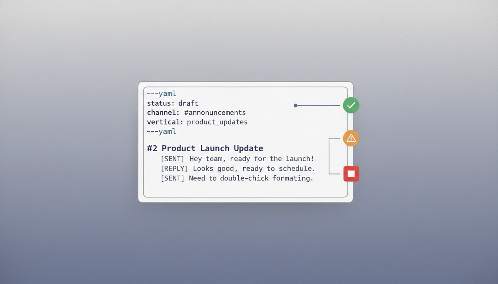
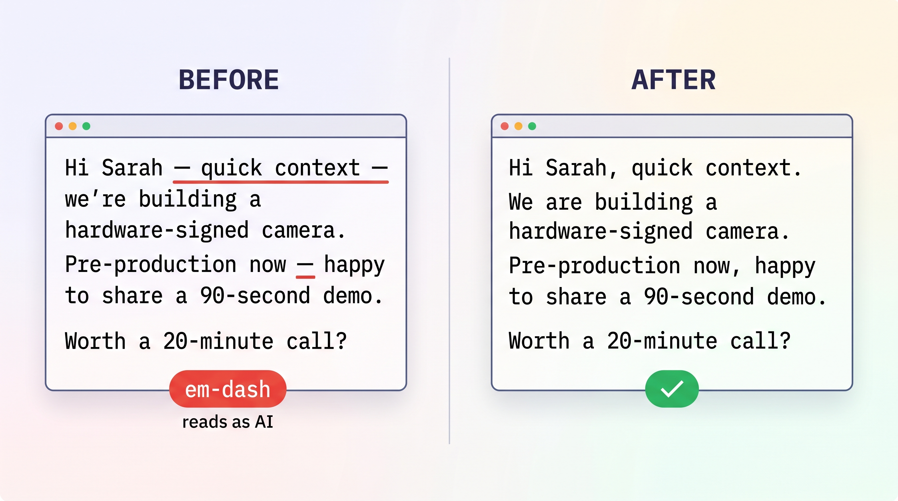
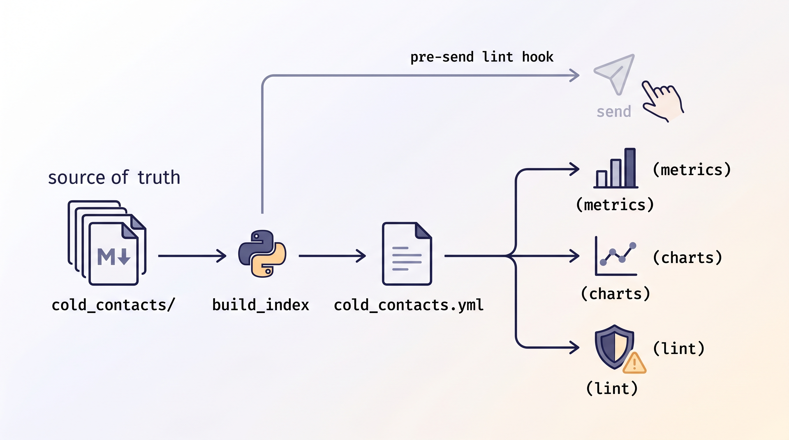

# autoreachout

[](https://github.com/mutantQ/autoreachout/actions/workflows/ci.yml)
[](LICENSE)
[](https://www.python.org/)
[](CONTRIBUTING.md)
[](https://github.com/mutantQ/autoreachout/issues?q=is%3Aissue+is%3Aopen+label%3A%22good+first+issue%22)



> a markdown-first cold outreach harness. every contact is a `.md`
> file. a 16-rule linter yells at you *before* you hit send. metrics
> and charts pop out the back.

cold outreach drifts back to template-bait the moment you stop writing
things down. this is the discipline of writing it all down, with just
enough python to make the writing pay you back.

> **status:** research framework / personal tooling, used in production
> by the maintainer for b2b outreach. not a hosted service.
>
> **honest bias:** built against a korean-b2b outreach pipeline, so
> the channels (kakaotalk, remember 리멤버), the tone-match rules, and
> several worked examples lean korean. the architecture is locale-
> agnostic; coverage outside kr is thin. **global contributors very
> welcome.** see [roadmap](#roadmap--where-help-is-wanted).

---

## try it in 60 seconds

```bash
git clone https://github.com/mutantQ/autoreachout
cd autoreachout
uv sync --extra dev               # or: pip install -r requirements.txt
uv run python scripts/build_index.py     # → 60 contacts indexed
uv run python scripts/lint/run_lint.py --all   # → 0 blocks 0 warnings
uv run python scripts/analyze.py         # → engagement metrics
uv run pytest -q                  # → 349 tests pass
```

requires python 3.13+. all of that runs against the bundled fictional
contacts; no real data needed to kick the tires. when you're ready to
swap in your own pipeline, edit `scripts/lint/_config.py` (single
file, ~6 settings) and follow [setup.md](SETUP.md).

**what you'll see, in order:** an indexed yaml of 60 fictional
contacts → a clean lint sweep across 63 files → an engagement-rate
report (38.8% engaged, 7 contacts flagged as accepted-no-followup) →
a green test suite. then break a draft on purpose (add an em-dash to
any `cold_contacts/*.md` body, or propose an nda in an investor-
tagged contact) and re-run the sweep to watch the linter catch it.

---

## what it screams at you about



a recent public founder-outreach workshop catalogued the eight most
common cold-outreach mistakes. the 16 lint rules in this repo predate
that workshop but map to the same failure-mode taxonomy, in roughly
the same order the maintainer hit them in their own pipeline:

| failure mode | rules in this repo that catch it |
|---|---|
| **#2 opener is copy-pasted, we can tell it's ai** | `em-dash` (yes, the m-dash thing, the rule literally calls it out), `language-signoff`, `in-house-abbrev`, `no-markdown-in-body`, `linkedin-ui-artifacts` |
| **#3 way too long** | `connection-note-length` (300-char hard cap on linkedin notes) |
| **#8 treats every platform the same** | `outbound-draft-channel-mismatch`, `link-prefix-https` |

three of her eight. that's it. the repo also catches a bunch of
*workflow-hygiene* failures she didn't cover (frontmatter drift, bom
leaks, drafts in the wrong directory, timezone-conversion math wrong
in confirmation emails, nda proposed to a vc, forbidden email
slipping into a body, one-entity-two-files duplication), which adds
up to 13 of the 16 rules. the gap is the contributor surface.

### what's *not* lint-caught yet (5 of her 8), open to prs
- **#1 forgettable subject line.** the hardest one to encode without
  false positives. would love a worked-example rule from someone who
  has shipped enough subject lines to know the patterns.
- **#4 ask feels like homework.** this is the hedging-detection rule.
  ("if maybe you had a few minutes, possibly we could…"), open to a
  rule that fires on stacked hedges + missing concrete asks.
- **#5 you ghost yourself.** the analyze.py report flags
  `accepted-no-followup` as a status, but there's no lint rule for the
  follow-up itself.
- **#6 makes it all about you.** an i/we/my-density rule vs. a
  you/your-density rule would be a clean ratio check.
- **#7 too formal.** "dear miss may i please", register-mismatch
  detection. probably needs a per-vertical config.

if any of those failure modes is one you've personally hit, [open a
new-rule issue](.github/ISSUE_TEMPLATE/lint-rule.md), the bar is one
worked example + a positive test + a negative test + an exempt-zone
test. that's it.

---

## what's actually in here

| thing | count |
|---|---|
| pre-send lint rules | **16** |
| tests, all passing | **349** |
| reusable claude code skills | **4** |
| fictional example contacts | **50+** |
| verticals covered in example data | **10** |
| outbound clicks the harness automates | **0** (every send stays manual) |



`cold_contacts/*.md` is the source of truth. everything downstream is
regenerable from those files, index, metrics, charts, lint reports.
the harness never clicks send.

---

## the lint catalogue (full)

| rule | severity | what it catches |
|---|---|---|
| `em-dash` | block | em-dashes (also en-dashes, double-hyphens) in outbound bodies. when most readers assume any em-dash means AI-drafted, the dash itself becomes a tell. blockquotes, frontmatter, table separators, and the `<!-- lint-disable em-dash -->` marker are exempt. |
| `linkedin-ui-artifacts` | block | UI fragments accidentally pasted from linkedin ("• 3rd", "open to work") |
| `one-file-per-entity` | block | same person tracked in two files (`cold_contacts/` AND `drafts/`) |
| `frontmatter-schema` | block | unknown frontmatter fields (drift between files) |
| `connection-note-length` | block | linkedin connection notes over 300 chars |
| `email-domain-leak` | block | configured forbidden email leaking into outbound (e.g. your university email when you should be sending from your work one) |
| `bom-leak` | block | bom characters in body (paste from external editor) |
| `vc-nda` | block | nda proposed to investor-tagged contact (instant signal of inexperience) |
| `link-prefix-https` | warn | bare project domain without `https://` (won't auto-link in linkedin or many email clients) |
| `language-signoff` | block | korean body + english-only sign-off (the "translated pitch" tell), or the inverse |
| `drafts-in-omc` | block | drafts written to scratch dir instead of `cold_contacts/` |
| `body-headings` | warn | non-canonical body section headers |
| `no-markdown-in-body` | block | bold / inline code / `[link](url)` inside outbound text (recipients see literal `**` chars) |
| `timezone-conversion` | block | wrong arithmetic in `H:MM TZ1 (= H:MM TZ2)` constructions. Cross-timezone confirmation prose is easy to get wrong by an hour, and recipients trust the prose over the calendar invite. |
| `outbound-draft-channel-mismatch` | block | linkedin-only draft header on a non-linkedin channel |
| `in-house-abbrev` | block | configured in-house abbreviation in conversational outbound |

every block has a `<!-- lint-disable rule-name -->` per-file escape.

---

## the korean-b2b bias, made concrete

the `language-signoff` rule fires on the most common kr-b2b cold-mail
failure: korean body, english-only sign-off ("co-founder & ceo,
acme"). the rule wants either a korean closer (`드림` / `올림`) or an
english body to match the english sign-off. equivalent rules for
keigo (jp), tú/usted (es), sie/du (de), tu/vous (fr) don't exist
yet, see roadmap.

other kr-flavored bits:
- `in-house-abbrev` generalizes a korean failure: in-house acronyms
  that read fine in private notes but break tone in conversational
  sms / kakaotalk
- `scripts/sync_kakao.py` reads the local macos kakaotalk db via
  `kakaocli`, opt-in per-contact via `kakaotalk_chat_id`
- `remember (리멤버)` is a recognized channel value (kr business-card
  platform)
- `typo-prevention-cold-drafts` skill encodes 드림 / 올림 closer
  conventions and honorific landmines

what's *thin* outside kr (this is the contribution invite):
- no tone-match rules for japanese (keigo register), mandarin, spanish
  (tú/usted), german (sie/du)
- no us/eu enterprise-sales-conventions rules (subject-line norms,
  "circling back" patterns, sequence cadences)
- no non-linkedin us channels (slack, whatsapp, telegram, imessage)
- no auto-sync from gmail / gcal (today: manual paste of verbatim
  replies)

---

## what `analyze.py` looks like

```
============================================================
OUTREACH METRICS, 2026-05-05
============================================================

Total contacts: 60
  acme-related: 60

STATUS DISTRIBUTION (all)
----------------------------------------
  mou_signed             2
  met                    6
  replied                8
  declined               3
  accepted               7
  sent                  23
  draft                  9
  skipped                2
  TOTAL                 60

ENGAGEMENT RATES (acme-related, excl. skipped/draft)
----------------------------------------
  Active contacts:    49
  Engaged (replied+): 19 (38.8%)
  Positive total:     26 (53.1%)

BY CONTACT TYPE
----------------------------------------
  cold            51    25.0%
  warm             4   100.0%
  referral         3   100.0%
  inbound          2   100.0%

NEEDS FOLLOW-UP (accepted, no followup recorded)
----------------------------------------
  Chioma Eze (Veritas Standards Consortium), accepted 18d ago
  Priya Raman (Coastline Mutual Insurance), accepted 19d ago
  ...
```

(numbers are from the bundled fictional dataset. swap in your own
contacts and the partition will recompute against `PRIMARY_ENTITY` in
`scripts/lint/_config.py`.)

---

## roadmap / where help is wanted

honest read: this is one founder's harness, hardened by daily korean-
b2b use. the architecture is locale-agnostic but the coverage outside
kr is thin. **global contributors are the highest-leverage bet right
now.** if you run cold outreach in any non-kr context, your worked-
example rules harden this permanently for everyone.

### the contributor surface (5 of the 8 common mistakes are not yet lint-caught)
covered above; tldr: subject-line forgettability, hedging asks,
ghosting yourself, all-about-you, too-formal. open prs for any.

### locales (the biggest single gap)
- english / us enterprise sales rules: "circling back" cadence,
  sequence-spam detection, "as i mentioned in my last email"
- english / uk & eu (cooler register, gdpr footers)
- japanese keigo register match
- mandarin formal/informal pronoun + signoff matching
- spanish tú/usted, german sie/du, french tu/vous

### channels
- slack dm (us default for warm-intro pipelines)
- whatsapp business (latam, eu, india b2b default)
- telegram (crypto / eastern european founders)
- twitter / x dms (inbound + outbound)
- threads / bluesky (inbound for media outreach)
- imessage on macos (the channel some us founders default to)
- naverworks (kr enterprise)
- kakaobiz (currently only consumer kakaotalk)

### workflow
- auto-sync gmail thread state into frontmatter (today: manual paste)
- auto-sync gcal event status into `meeting_at` / `met_at`
- first-class `kakaocli` support on linux/windows (today: macos only)
- cli scaffolding from a linkedin url

### discovery hardening (the highest-leverage of all)
each of the 16 rules in this repo traces back to a specific outreach
mistake the maintainer made. the strongest contribution you can ship
is the same with mistakes you've made:

1. document the failure (what message, what context, what went wrong)
2. pin down the smallest pattern that catches it
3. pin down the false-positive zones (where the same pattern
   legitimately appears)
4. ship a one-file rule + paired test file

the
[new lint rule issue template](.github/ISSUE_TEMPLATE/lint-rule.md)
walks you through it.

---

## module map

| path | role |
|---|---|
| `scripts/build_index.py` | regen `cold_contacts.yml` from `cold_contacts/*.md` frontmatter |
| `scripts/analyze.py` | engagement metrics (text / json) |
| `scripts/charts.py` | matplotlib charts (status, vertical, channel, contact-type, period) |
| `scripts/sync_kakao.py` | kakaotalk activity sync, opt-in per-contact via `kakaotalk_chat_id` |
| `scripts/lint/run_lint.py` | pre-tool-use lint dispatcher (hook entry point + manual sweep mode) |
| `scripts/lint/_config.py` | project-specific identifiers, the only file you need to edit to adapt the harness |
| `scripts/lint/rules/*.py` | one file per rule, independently testable |
| `scripts/lint/schemas.yml` | canonical frontmatter field list |
| `cold_contacts/{slug}.md` | per-contact state + verbatim message log (the source of truth) |
| `vendors/{slug}.md` | service-vendor records (law firms, hardware vendors) |
| `standard_bodies/{slug}.md` | standards-body membership state |
| `events/{year}-{slug}.md` | conference / trip umbrella records |
| `pitch_events/{date}-{slug}.md` | pitch-event recaps + lessons |
| `reports/OUTREACH_REPORT.md` | periodic regenerable status report |
| `.claude/skills/` | 4 reusable skills (contact-manager, outreach-email, outreach-reflection, typo-prevention-cold-drafts) |

---

## adapting to your project

single editable surface: `scripts/lint/_config.py`. exposes founder
name, founder email, forbidden email, project domains, in-house
abbreviations, primary-entity tag. re-run
`uv run pytest scripts/lint/tests/ -q` after changes.

for first-time setup of `kakaocli`, optional gmail / calendar mcp
wiring, and where to put real contact data so it never lands in git,
see **[setup.md](SETUP.md)**.

---

## contributing

prs and issues welcome, *especially* worked-example lint rules and
channel integrations from the [roadmap](#roadmap--where-help-is-wanted).
the bar is short:

1. new rule → paired tests + entry in `scripts/lint/run_lint.py`
2. new frontmatter field → entry in `scripts/lint/schemas.yml`
3. `uv run pytest` and `uv run python scripts/lint/run_lint.py --all`
   both clean before push

want to discuss before coding? open an issue with the failure mode or
channel you want to address. roast welcome.

see **[contributing.md](CONTRIBUTING.md)** for the full conventions.

---

## maintainer

built and maintained by [@mutantQ](https://github.com/mutantQ), who
runs this against an actual cold-outreach pipeline. if something
surprises you in the data model, that's almost certainly because of
a real outreach incident, not theoretical aesthetics.

if this is useful to you, the highest-value way to say thanks is to
contribute a worked-example rule from your own pipeline.
