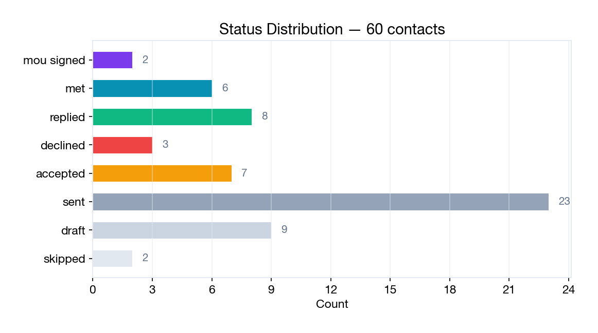
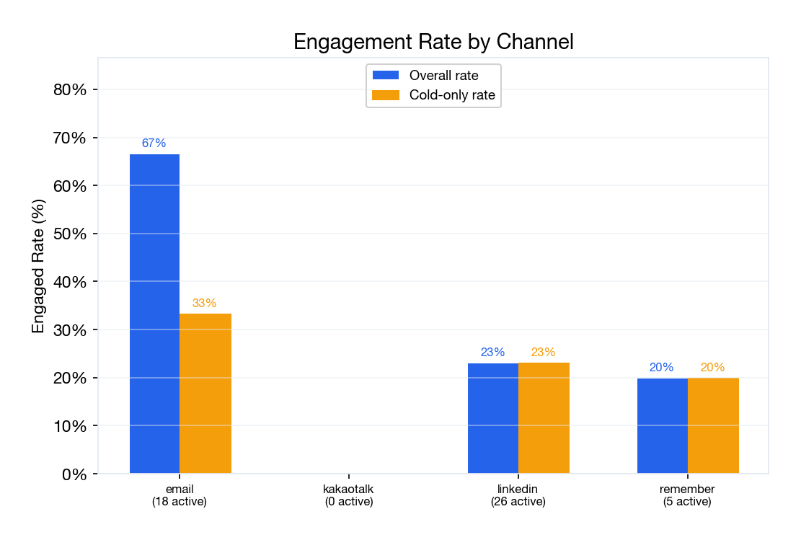
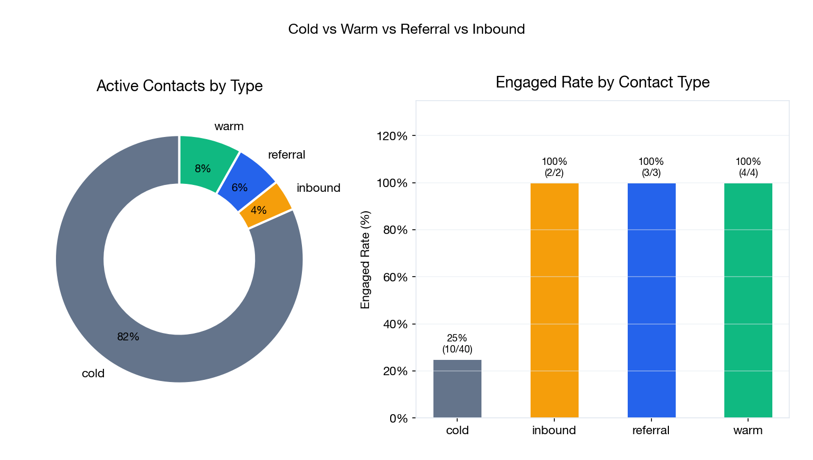
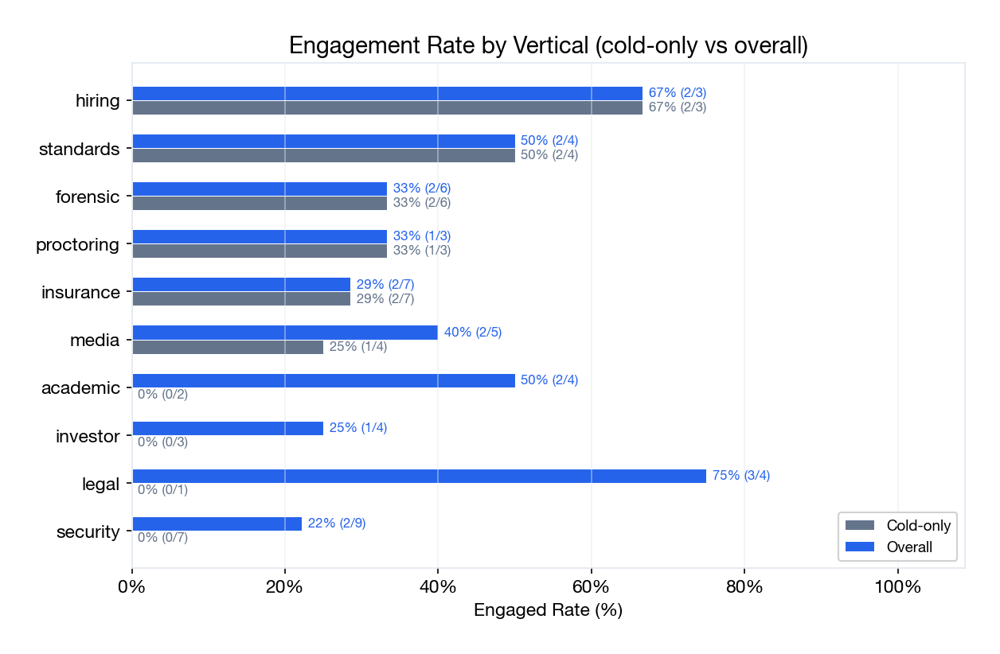

# outreach report (sample, v2)

> sample report regenerated against the bundled 60 fictional
> `cold_contacts/`. real reports replace this file periodically (the
> maintainer runs it weekly to bi-weekly). this is the format the
> `contact-manager/regen.md` skill produces.

## tldr

- 60 contacts, 49 active (excl. 9 draft, 2 skipped)
- 19 engaged (38.8%); 26 positive when accepted-still-engaging is included (53.1%)
- 2 mou signed, 6 met, 8 replied, 7 still-accepted-awaiting-next-turn
- warm / referral / inbound all 100% engaged (n=9 combined)
- cold conversion: 25.0% engaged on the cold pool (n=40 active)
- 7 accepted contacts have no follow-up recorded; next batch of
  follow-ups is the highest-leverage move

## status distribution

| status | count |
|---|---|
| mou_signed | 2 |
| met | 6 |
| replied | 8 |
| accepted | 7 |
| declined | 3 |
| sent | 23 |
| draft | 9 |
| skipped | 2 |
| **total** | **60** |

## by channel

| channel | total | active | engaged | rate | cold-only |
|---|---|---|---|---|---|
| email | 20 | 18 | 12 | 66.7% | 3/9 (33.3%) |
| linkedin | 33 | 26 | 6 | 23.1% | 6/26 (23.1%) |
| remember (리멤버) | 6 | 5 | 1 | 20.0% | 1/5 (20.0%) |
| kakaotalk | 1 | 0 | 0 | n/a | n/a |

email beats linkedin 3x on this dataset; partly because the email
sample is smaller and includes warm intros. the cold-only column
controls for that.

## by contact type

| type | count | engaged | rate |
|---|---|---|---|
| cold | 51 | 10 | 25.0% (active pool: n=40) |
| warm | 4 | 4 | 100% |
| referral | 3 | 3 | 100% |
| inbound | 2 | 2 | 100% |

warm / referral / inbound conversion is always near 100%. the
acquisition cost is in getting one in the first place, not in
converting it.

## by vertical

10 verticals covered: security (6), insurance (5), forensic (4),
media (4), investor (4), academic (3), proctoring (3), standards
(3), legal (3), hiring (3). MOUs land in proctoring (`jin-park`)
and insurance (`olamide-fashola`); legal is 3/3 engaged.

## needs follow-up

7 accepted contacts with no follow-up recorded:

- chioma eze (veritas standards consortium), accepted 18d ago
- priya raman (coastline mutual insurance), accepted 19d ago
- adaeze nwachukwu (proctorbridge), accepted 17d ago
- rajesh pillai (harborview ventures), accepted 16d ago
- nkechi obi (pinnacle investigations), accepted 15d ago
- felix bauer (cipherworks ag), accepted 13d ago
- jerome petit (lexon media group), accepted 11d ago

batch a single follow-up wave next.

## what changed since v1

- contact count: 12 → 60 (38 new)
- new charts regenerated against the 60-contact data
- no new lint rules; the existing 16 still pass clean across all 63
  scanned files (60 cold contacts + 1 vendor + 1 standards body + 1
  pitch event report)

## what `analyze.py` outputs verbatim

run `uv run python scripts/analyze.py` for the full text dump,
including channel breakdowns, period comparison, and a per-contact
list under each status.

## file system reference

| file | description |
|---|---|
| `cold_contacts.yml` | master contact index (regenerated) |
| `cold_contacts/{slug}.md` | per-contact source of truth |
| `vendors/{slug}.md` | service-vendor records |
| `standard_bodies/{slug}.md` | standards-body membership |
| `events/{year}-{slug}.md` | conference / trip umbrella |
| `pitch_events/{date}-{slug}.md` | pitch-event recap |
| `reports/OUTREACH_REPORT.md` | this report |
| `reports/charts/*.png` | regenerated charts |
| `scripts/analyze.py` | metrics |
| `scripts/build_index.py` | yaml index regen |
| `scripts/lint/run_lint.py` | 16-rule linter |
| `scripts/lint/_config.py` | project identifiers (the only file you edit to adapt the harness) |
| `.claude/skills/` | 4 reusable skills (contact-manager, outreach-email, outreach-reflection, typo-prevention-cold-drafts) |

## update log

- **v1 (initial):** 12 contacts, 4 skills, 16 lint rules.
- **v2 (this version):** 60 contacts, github actions ci wired up,
  issue + pr templates added, readme rewritten for public
  contributor audience, hero / flow / lint example images embedded.

run `uv run python scripts/analyze.py` for the latest numbers.
